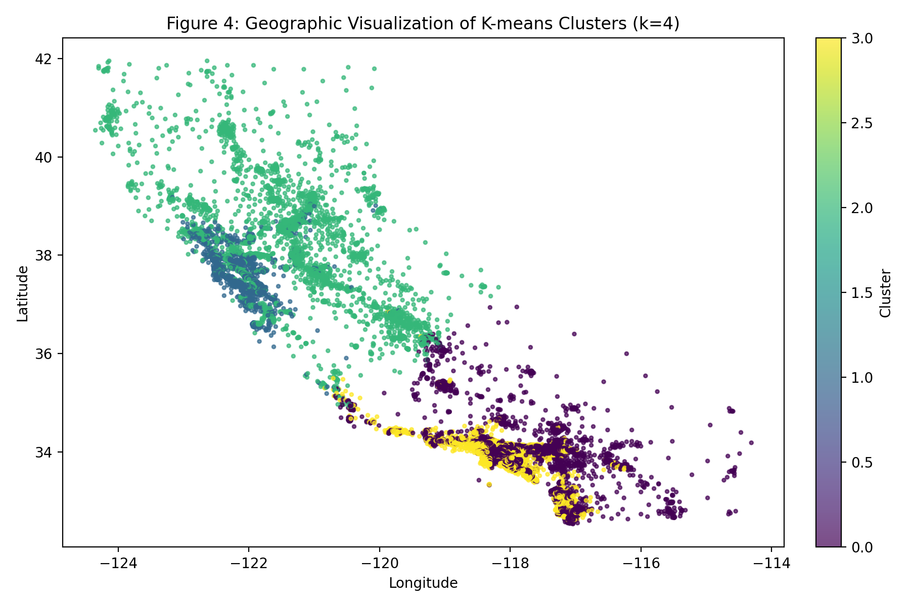
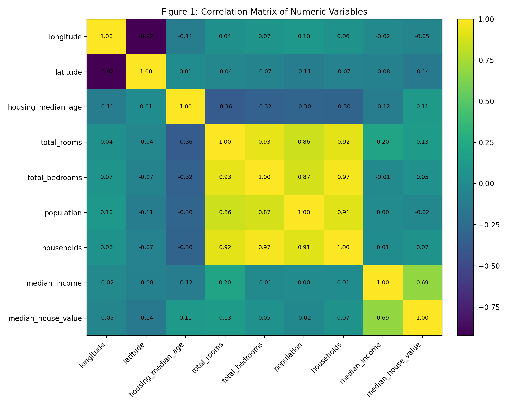
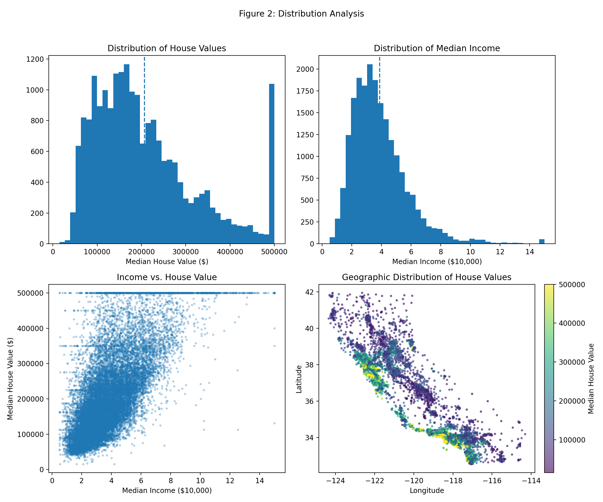
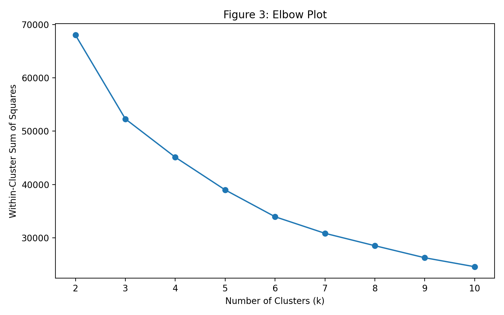
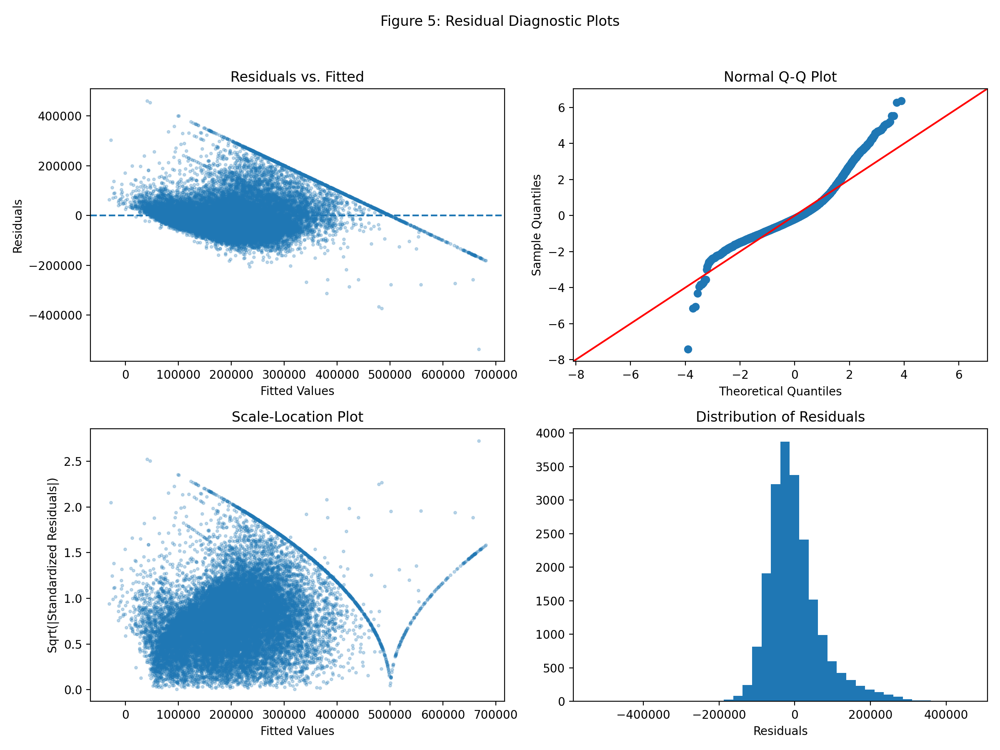

# California Housing Affordability — Reproducible Analysis

Reproducible statistical analysis of California housing values (1990 census), focusing on income effects and ocean proximity.

**Report (PDF):** [california_housing_affordability_public.pdf](report/california_housing_affordability_public.pdf)

## Repository structure
```text
report/  PDF report
src/     Python analysis script
outputs/ figures + tables generated by the script
data/    how to download housing.csv
```

## At-a-glance results (matches the report)
- Correlation r(median_income, median_house_value) ≈ **0.69**
- Multiple regression R² ≈ **0.6076** (F ≈ **3993.81**, p < **0.0001**)
- One-way ANOVA across ocean proximity: F ≈ **1612.14**, η² ≈ **0.238**, p < **0.0001**
- K-means (k=4) silhouette ≈ **0.315**
- 5-fold CV R² mean ≈ **0.6433** (SD ≈ **0.0224**, min ≈ **0.6179**, max ≈ **0.6744**)

## Key figures
**Figure 4 — Geographic clustering**


**Figure 1 — Correlation matrix**


<details>
  <summary>More figures</summary>

**Figure 2 — Distribution analysis**  


**Figure 3 — Elbow plot**  


**Figure 5 — Residual diagnostics**  


</details>

## Quickstart (local)
```bash
pip install -r requirements.txt
# place housing.csv in repo root (see data/README.md)
python src/california_housing_affordability_analysis.py
